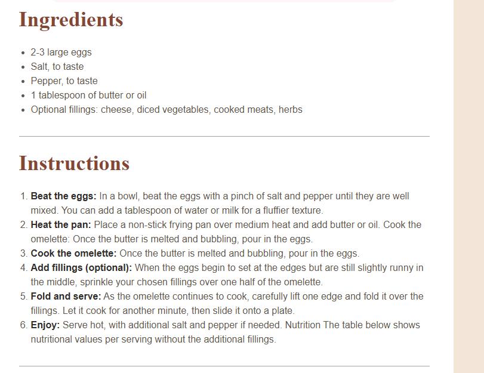

# Recipe Page

This project involved creating a replica of a Recipe Page homepage, adhering strictly to a provided design. The challenge was to match the design 1:1 without any additional guidance on the code or frameworks to be used. The primary technologies leveraged for this project were ReactJS, JavaScript, TailwindCSS, and Vite.

This is a solution to the [Recipe page challenge on Frontend Mentor](https://www.frontendmentor.io/solutions/reactjs-tailwindcss-javascript-vite-recipe-page-YJkN1Fx0Gi). 

## Table of contents

- [Overview](#overview)
  - [The challenge](#the-challenge)
  - [Screenshot](#screenshot)
  - [Links](#links)
- [Development Journey](#development-journey)
  - [Built with](#built-with)
  - [Continued development](#continued-development)
- [Author](#author)

## Overview

The project's scope involved developing a Simple Recipe page using ReactJS, Tailwind CSS, JavaScript, and Vite. I was provided with a collection of assets, including design examples, images, logos, and fonts. The image was a an omelette picture. The fonts used were Outlier and XXX. The website featured a image in the center top of the page, several distinct text sections, several listed items, and a table at the end. The project required a precise understanding of color combinations, styling, and table layouts.

### Screenshots

### Links

- Solution URL: [Laura Developer Solution Frontend Mentor](https://www.frontendmentor.io/solutions/reactjs-tailwindcss-javascript-vite-recipe-page-YJkN1Fx0Gi)
- Live Site URL: [Netlify Recipe Page](https://recipepage-lauradeveloper.netlify.app/)

## Development Journey

1. Initiated the project by downloading and thoroughly reviewing all the starter code and files. This step was crucial for effective planning.
2. Updated the README using a template from Frontend Mentor. This allowed me to document my progress and thoughts while developing the application.
3. Set up a public repository on GitHub to version control my project and share my progress.
4. Utilized Vite to create a new React project, providing a fast and efficient development environment.
5. Integrated TailwindCSS into the project. Encountered and resolved some compatibility issues between ESModules and CommonJS syntax.
6. Customized my TailwindCSS theme to include the specific colors provided. Also, incorporated Google Fonts into my project by adding them to TailwindCSS config file.
7. Configured my repository for publishing on Netlify, enabling continuous deployment and live preview of my project.
8. Revisited the design file and added the provided assets (photographs) to the project.
9. Began constructing the website's structure using `div` elements and added the necessary text to outline each section.
10. Enhanced the website's visual appeal by adding the omelette image to the header.
11. Added color and font to each section based on design assets and layout given.
12. I began by sizing the font and pictures for different layouts - desktop vs mobile.
13. After reviewing all the general features of the website, I went through each individual section and updated according to the design. 
14. Finally I reviewed the page for mobile responsiveness.

### Built with

- [React](https://reactjs.org/) - JS library
- TailwindCSS
- Vite
- JavaScript
- Semantic HTML5 markup
- CSS custom properties
- Flexbox
- Mobile-first workflow

### Continued development

I would like to continue focusing on my knowledge of TailwindCSS, React and JavaScript.

## Author

- Website - [Laura Developer](https://lauradeveloper.com/)
- Frontend Mentor - [@lavollmer](https://www.frontendmentor.io/profile/lavollmer)

